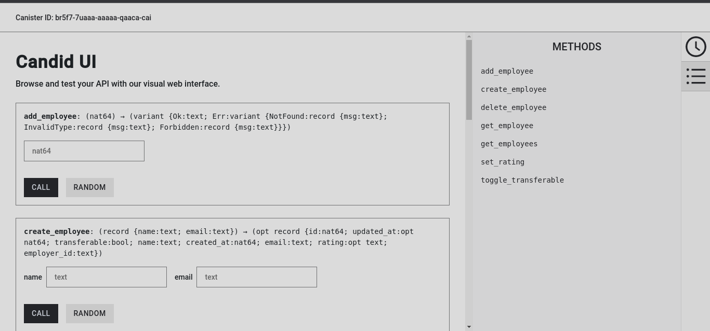

# Employee Management Software ICP Canister

This is a Proof of Concept (PoC) ICP Canister built using the Rust programming language. This smart contract offers its users the ability to organise their
employees. Users can perform **CRUD** operations on employee records using the functions exposed by the canister.

Functions available for interacting with the smart contract include:

- **create_employee** -> create an employee record
- **delete_employee** -> delete an employee record
- **set_rating** -> give an employee record a rating. Accepted values are: ["excellent", "good", "average", "satisfactory", "poor"]
- **get_employee** -> retrives an employee record by its ID.
- **get_employees** -> retrives all employee records available to the caller.
- **toggle_transferable** -> toggles an employee record **transferable** field to **true**/**false**. This is essential for swaping employees.
- **add_employee** -> allows a user to make an employee record theirs. The employee record must have their **transferable** field set to true.

 ## Interacting with the EMS Canister
 Refer to this [section](https://dacade.org/communities/icp/courses/rust-smart-contract-101/learning-modules/3709d471-cd65-495d-b580-c0dbc2f1f5d8#1-setup)
 to setup your command execution environment with **dfx** and **Rust**. 

 Follow the steps below to run and interact with the canister locally:

 1. Clone this repository.
 2. In the cloned directory, open your terminal and run `cargo build` to install all neccessary dependencies.
 3. In your terminal, run the following commands:
    - `chmod +x did.sh` to make the did.sh bash script an excutable.
    - `./did.sh` to generate the candid file (a file that tells icp how to interact with our rust code).
    - `npm start` to start the **dfx server** that will host our canister when deployed.
    - `npm run deploy` to deploy our canister to our local **dfx server**.
4. Follow the link to interact with the canister in your browser.

**PS**: for the **npm scripts** to work, you will need to install Node.js version 18+.
Below is a screenshot of what the Candid interface looks like for our canister.

## Contributing
Found a bug or thought of a neat feature to add? Fork the repo and open a pull request!
